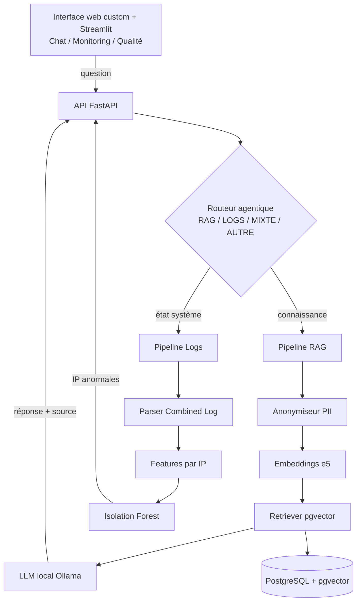

<div align="center">

# 🛰️ Vala Bleu Ops Copilot

### Assistant agentique **RAG + détection d'anomalies** — inférence LLM **100 % locale**

*Un seul agent pour répondre à la fois aux questions de connaissance métier et à l'état opérationnel des serveurs, sans qu'aucune donnée ne quitte le périmètre.*


**Auteur :** Abderrahman Kayouh · [LinkedIn](https://www.linkedin.com/in/abderrahman-kayouh)

</div>

---

## 🎯 Problématique

Un hébergeur web jongle avec **deux flux d'information disjoints** :
1. **La connaissance métier** (documentation, procédures, tickets) — dispersée et non interrogeable sémantiquement.
2. **L'état opérationnel** (logs serveurs, trafic, anomalies) — surveillé manuellement.

> **Comment un agent unique peut-il répondre aux deux** — *« Comment configurer un MX ? »* **et** *« Y a-t-il une anomalie de trafic ? »* — tout en **garantissant la confidentialité** (inférence locale) et des réponses **traçables et mesurées** ?

---

## 🎥 Démo

<div align="center">

<!-- 👉 Ajoute ta capture : place-la dans docs/ puis décommente la ligne ci-dessous -->
<!--  -->

*Capture du dashboard (onglets Chat / Monitoring / Qualité) — à insérer.*

</div>

---

## 🏗️ Architecture



**Flux :** une question est **routée** (RAG / LOGS / MIXTE), puis traitée par le pipeline adapté. Le RAG récupère les passages pertinents et les transmet au **LLM local** qui répond **en citant sa source**. Le pipeline Logs détecte les **IP anormales** (brute-force, scan).

---

## ✨ Fonctionnalités

| | |
|---|---|
| 🔎 **RAG documentaire** avec citation de source | 🧭 **Routeur agentique** 4 intentions (RAG / LOGS / MIXTE / AUTRE) |
| 🌍 **Multilingue** FR / EN / AR (retrieval cross-lingue) | 💬 **Repli conversationnel** pour le hors-sujet |
| 🛡️ **Anonymisation PII** avant indexation (RGPD) | 📊 **Détection d'anomalies** (Isolation Forest) |
| 🌊 **Monitoring temps réel** (architecture Lambda) | ⚡ **Scalable** : 1 M lignes en mémoire constante |
| 🔒 **Inférence LLM 100 % locale** (Ollama) | 📈 **Évaluation quantitative** (RAGAS) |
| 🐳 Architecture **découplée & conteneurisée** | 🖥️ **2 frontends** (web custom + Streamlit) sur la même API |

---

## 🛠️ Stack technique

| Couche | Technologie |
|---|---|
| Inférence LLM | Ollama — Qwen 2.5 (quantifié) |
| Embeddings | `intfloat/multilingual-e5` (FR / EN / AR) |
| Multilingue | `langdetect` + retrieval cross-lingue |
| Base de données | PostgreSQL 16 + `pgvector` |
| Détection d'anomalies | scikit-learn — Isolation Forest |
| Traitement temps réel | Architecture **Lambda** (couches batch + speed) |
| Backend API | FastAPI |
| Frontend | Interface web custom + Streamlit |
| Évaluation | RAGAS |
| Conteneurisation | Docker + Docker Compose |
| Matériel / Déploiement | Serveur on-premise — **GPU NVIDIA** |

---

## 📁 Structure du projet

```
vala-bleu-ops-copilot/
├── backend/app/
│   ├── rag/          # ingestion, anonymiseur, retriever, chaîne RAG, tickets
│   ├── logs/         # parser, features, Isolation Forest, analyse
│   ├── router/       # routeur agentique (prompt-based + classifieur)
│   └── main.py       # API FastAPI
├── frontend/app.py   # dashboard Streamlit (3 onglets)
├── eval/             # golden dataset + runner RAGAS
├── db/schema.sql     # schéma PostgreSQL (documents, chunks)
├── scripts/          # scraper de la base de connaissance
└── docker-compose.yml
```

---

## 🚀 Installation

**Prérequis :** Docker Desktop · Python 3.11 (Anaconda) · [Ollama](https://ollama.com)

```bash
# 1. Environnement
conda create -n valableu python=3.11 -y && conda activate valableu
pip install -r requirements.txt

# 2. Base de données (PostgreSQL + pgvector)
docker compose up -d
docker exec -i valableu_db psql -U valableu -d valableu < db/schema.sql

# 3. Modèle LLM local
ollama pull qwen2.5:3b          # (ou 1.5b sur CPU)

# 4. Ingestion de la base de connaissance
python backend/app/rag/ingestion_pipeline.py
```

> ⚙️ Les identifiants DB sont dans un `.env` (non versionné). La base écoute sur le port **5433**.

---

## ▶️ Utilisation

**Architecture découplée → deux services :**

```bash
# Terminal 1 — API + interface web custom
python backend/app/main.py           # UI → http://127.0.0.1:8000/  ·  API docs → /docs

# Terminal 2 — Dashboard Streamlit (optionnel)
streamlit run frontend/app.py        # → http://localhost:8501
```

---

## 📊 Résultats mesurés

| Volet | Métrique | Résultat |
|---|---|---|
| 🧭 **Routeur** | Précision (validation croisée 5-fold) | **95 % ± 4 %** *(classifieur)* · 60 % *(prompt-based)* |
| 📊 **Détection d'anomalies** | Recall / Faux positifs *(anomalies injectées)* | **100 % / 4 %** |
| 🔎 **RAG** | Faithfulness, Answer Relevancy *(RAGAS)* | *évaluation finale en cours* |
| ⚡ **Scalabilité (logs)** | Débit / mémoire *(traitement en flux)* | **~42 k lignes/sec · 0,3 Mo** pour 1 M lignes |

> **Protocole anomalies :** injection contrôlée de brute-force + scans (labels connus) → mesure objective du Recall et du taux de faux positifs.

---

## ⚠️ Limites assumées

*(Nommer ses limites est un choix de rigueur — chaque point est un arbitrage conscient et documenté.)*

- **Jeu de logs** : logs réels du serveur, complétés par des logs publics + injection d'anomalies contrôlée.
- **Jeu de tickets** : tickets réels intégrés, complétés par des tickets synthétiques ancrés sur la doc.
- Pas de **fine-tuning** du LLM (RAG + prompt engineering).
- **MVP mono-nœud** — sans RBAC ni alerting temps réel.
- Évaluation RAGAS soumise au **biais du LLM juge**.

---

## 🗺️ Perspectives

- Déploiement **on-premise** sur serveur GPU du client.
- Intégration des **tickets réels** + golden dataset étendu.
- Étude comparative de **quantification** (GGUF vs AWQ) sur la qualité RAG.
- **Re-ranking** (cross-encoder) et recherche hybride.

---

<div align="center">

**Projet de Fin d'Année (PFA)** · Assistant IA agentique on-premise
*Python · FastAPI · Streamlit · pgvector · Ollama · scikit-learn · Docker*

</div>
