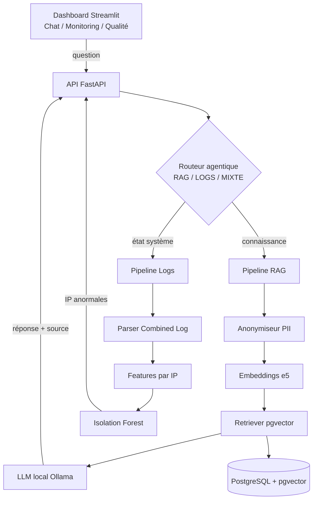

# 🛰️ Vala Bleu Ops Copilot

> Assistant **agentique** combinant **RAG documentaire** et **détection d'anomalies** sur logs serveur, avec **inférence LLM 100 % locale** (aucune donnée ne sort du périmètre). Cas d'usage : le support technique d'un hébergeur web (Vala Bleu, Agadir).

**Stack :** Python · FastAPI · Streamlit · PostgreSQL/pgvector · Ollama · scikit-learn · Docker

---

## 🎯 Problématique

Un hébergeur web jongle avec **deux flux d'information disjoints** :
1. **La connaissance métier** (documentation, procédures, tickets) — dispersée et non interrogeable sémantiquement.
2. **L'état opérationnel** (logs serveurs, trafic, anomalies) — surveillé manuellement.

**Comment un agent unique peut-il répondre aux deux** — *« Comment configurer un MX ? »* **et** *« Y a-t-il une anomalie de trafic ? »* — tout en **garantissant la confidentialité** (inférence locale) et en produisant des réponses **traçables et mesurées** ?

---

## 🏗️ Architecture



**Flux :** une question est **routée** (RAG / LOGS / MIXTE), puis traitée par le pipeline adapté. Le RAG récupère les passages pertinents et les transmet au **LLM local** qui répond **en citant sa source**. Le pipeline Logs détecte les **IP anormales** (brute-force, scan).

---

## ✨ Fonctionnalités

- 🔎 **RAG documentaire** avec **citation de source** (base : 225 articles réels de la doc Vala Bleu + tickets).
- 🧭 **Routeur agentique** d'intention (comparaison de 2 approches, cf. Résultats).
- 🛡️ **Anonymisation PII** (IP, email, téléphone, tokens) **avant indexation** — conformité RGPD/Loi 09-08.
- 📊 **Détection d'anomalies** non supervisée (Isolation Forest) sur logs Nginx/Apache.
- 🔒 **Inférence LLM 100 % locale** (Ollama) — aucune fuite vers une API tierce.
- 📈 **Évaluation quantitative** RAGAS (Faithfulness, Answer Relevancy).
- 🐳 Architecture **découplée** et conteneurisée.

---

## 🛠️ Stack technique

| Couche | Technologie |
|---|---|
| Inférence LLM | Ollama — Qwen 2.5 (quantifié) |
| Embeddings | `intfloat/multilingual-e5` (FR/EN) |
| Base de données | PostgreSQL 16 + `pgvector` |
| Détection d'anomalies | scikit-learn — Isolation Forest |
| Backend API | FastAPI |
| Frontend | Streamlit |
| Évaluation | RAGAS |
| Conteneurisation | Docker + Docker Compose |

---

## 📁 Structure du projet

```
vala-bleu-ops-copilot/
├── backend/app/
│   ├── rag/          # ingestion, anonymiseur, retriever, chaîne RAG, tickets
│   ├── logs/         # parser, features, Isolation Forest, analyse
│   ├── router/       # routeur agentique (prompt-based + classifieur)
│   └── main.py       # API FastAPI
├── frontend/app.py   # dashboard Streamlit (3 onglets)
├── eval/             # golden dataset + runner RAGAS
├── db/schema.sql     # schéma PostgreSQL (documents, chunks)
├── scripts/          # scraper de la base de connaissance
└── docker-compose.yml
```

---

## 🚀 Installation

### Prérequis
- Docker Desktop
- Python 3.11 (Anaconda recommandé)
- [Ollama](https://ollama.com) (inférence LLM locale)

### Étapes
```bash
# 1. Environnement
conda create -n valableu python=3.11 -y && conda activate valableu
pip install -r requirements.txt   # (ou les paquets listés dans le rapport)

# 2. Base de données (PostgreSQL + pgvector)
docker compose up -d
docker exec -i valableu_db psql -U valableu -d valableu < db/schema.sql

# 3. Modèle LLM local
ollama pull qwen2.5:3b          # (ou 1.5b sur CPU)

# 4. Ingestion de la base de connaissance
python backend/app/rag/ingestion_pipeline.py
```

> ⚙️ Les identifiants de la base sont dans un fichier `.env` (non versionné). La base écoute sur le port **5433** (pour cohabiter avec un PostgreSQL local éventuel).

---

## ▶️ Utilisation

**Deux services** (architecture découplée) → deux terminaux :

```bash
# Terminal 1 — API
python backend/app/main.py           # http://127.0.0.1:8000/docs

# Terminal 2 — Dashboard
streamlit run frontend/app.py        # http://localhost:8501
```

---

## 📊 Évaluation & résultats

| Volet | Métrique | Résultat |
|---|---|---|
| **Routeur** | Précision (validation croisée 5-fold) | **95 % ± 4 %** (classifieur) *vs* 60 % (prompt-based) |
| **Détection d'anomalies** | Recall / Faux positifs (anomalies injectées) | **100 % / 4 %** |
| **RAG** | Faithfulness, Answer Relevancy (RAGAS) | *évaluation finale en cours (GPU)* |

> Protocole anomalies : injection contrôlée de brute-force + scans, dont les labels sont connus → mesure objective du Recall et du taux de faux positifs.

---

## ⚠️ Limites connues

- **Dataset de logs** simulé (public + injection d'anomalies) — logs réels indisponibles.
- **Tickets** synthétiques ancrés sur la doc réelle (intégration de tickets réels en cours).
- Pas de **fine-tuning** du LLM (RAG + prompt engineering uniquement).
- **MVP mono-nœud**, sans RBAC ni alerting temps réel.
- Évaluation RAGAS soumise au **biais du LLM juge**.

---

## 🗺️ Perspectives

- Déploiement **on-premise** sur serveur GPU du client.
- Intégration des **tickets réels** + golden dataset étendu.
- Étude comparative de **quantification** (GGUF vs AWQ) sur la qualité RAG.
- Re-ranking (cross-encoder) et recherche hybride.

---

## 📄 Licence
**Auteur :** Abderrahman Kayouh — [www.linkedin.com/in/abderrahman-kayouh]
Projet académique (PFA). Voir `LICENSE`.
